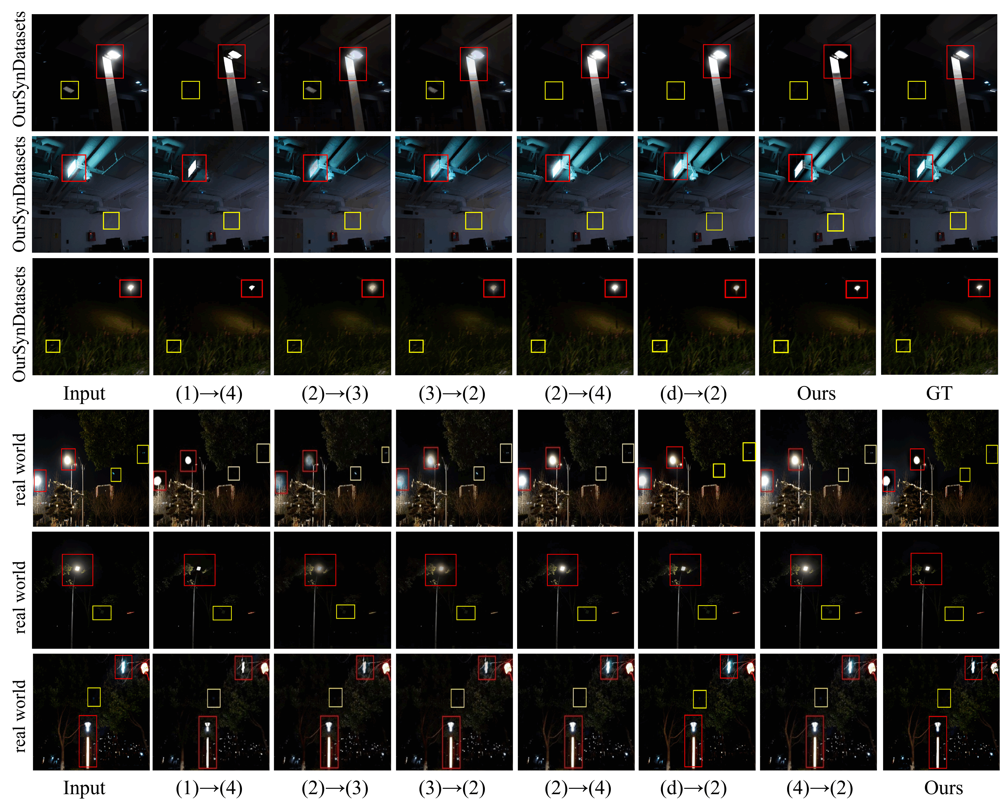
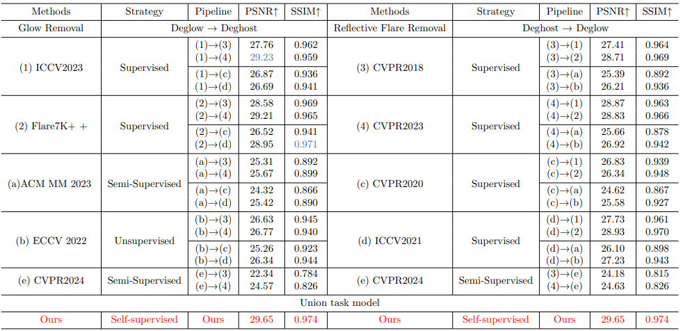
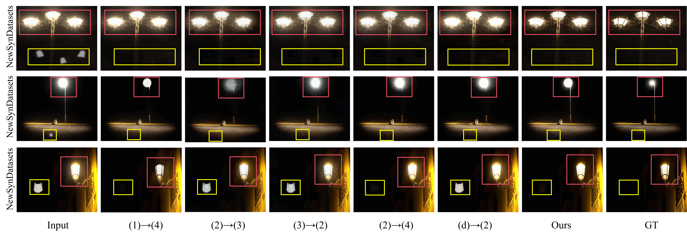

## Disentangle Nighttime Lens Flares: Self-supervised Generation-based Lens Flare Removal

| [**Paper**](https://example.com) | [**Supplementary Material**](https://example.com) |Accepted by AAAI2025

Yuwen He，Wei Wang，Wanyu Wu，Kui Jiang

### Joint task

Visual comparison of our SGLFR-Net and glow and reflection flare removal SOTA combinations in OurSynDatasets and real world datasets. Notation: (method1)→(method2).

Quantitative comparison of our SGLFR-Net with eight methods for joint removal of glow and reflection flare fields on OurSynDatasets.

#### NewSynDatasets

Due to the lack of paired joint flare datasets, we generated a new joint flare dataset (NewSynDatasets) using the glow generation method and dataset provided by (b) and the reflection flare generation method provided by (4).

Visual comparison of our SGLFR-Net and glow and reflection flare removal SOTA combinations in NewSynDatasets. Notation: (method1)→(method2).

Quantitative comparison of our SGLFR-Net with eight methods for joint removal of glow and reflection flare fields on NewSynDatasets.

### Reflective Flare Removal Task

Visual comparison of individual reflection removal task with SOTAs on BracketFlare Datasets and real world captured images.

Comparisons between our approach and reflection removal methods on BracketFlare dataset.

### Glow Suppression Task

Our visual comparison on individual glow suppression task with SOTAs on ECCV2022 datasets and real world captured nighttime glows.

Due to the lack of real glow pairing images at night, we used the dataset and glow generation method provided by (b) to synthesize pairing images to validate the effectiveness of our PSFR-Net.

**Notation:**

Glow suppression methods:

(1) ICCV2023: Improving lens flare removal with general-purpose pipeline and multiple light sources recovery.

(2) Flare7K++ (TPAMI2024) : Flare7k++: Mixing synthetic and real datasets for nighttime flare removal and beyond.

(a) ACM MM2023: Enhancing visibility in nighttime haze images using guided apsf and gradient adaptive convolution.

(b) ECCV2022: Unsupervised night image enhancement: When layer decomposition meets light-effects suppression.

(e) CVPR2024: A Semi-supervised Nighttime Dehazing Baseline with Spatial-Frequency Aware and Realistic Brightness Constraint.

Reflective flare methods:

(3) CVPR2018: Single image reflection separation with perceptual losses.

(4) CVPR2023: Nighttime smartphone reflective flare removal using optical center symmetry prior.

(c) CVPR2020: Single image reflection removal with physically-based training images.

(d) ICCV2021: Location-aware single image reflection removal.
